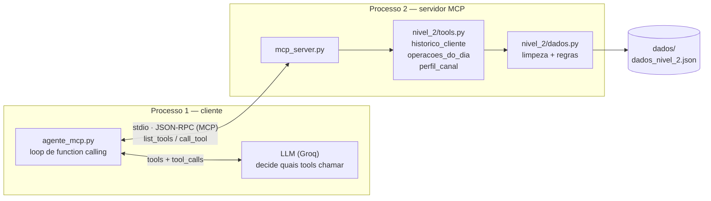

# Arquitetura — Nível 3, Trilha B (servidor MCP local)

## O que muda em relação ao Nível 2

No Nível 2 o agente **importa** as ferramentas e chama a função Python diretamente. Agente e
ferramentas vivem no mesmo processo e o agente conhece o código delas.

Na Trilha B, as mesmas ferramentas passam a ser expostas por um **servidor MCP local via
stdio**. O agente vira um processo cliente que só conhece o *contrato* publicado pelo servidor —
não o código. A lógica de negócio não foi reescrita: `nivel_3/mcp_server.py` importa as funções
de `nivel_2/tools.py` e as republica no protocolo.



Duas consequências práticas, e é por elas que a trilha vale a pena:

1. **Descoberta em runtime.** O agente não tem a lista de ferramentas hardcoded: ele chama
   `session.list_tools()` e traduz o que o servidor publicou para o formato que o LLM espera
   (`_mcp_para_openai` em `nivel_3/agente_mcp.py`). Publicar uma quarta ferramenta no servidor a
   torna disponível ao agente **sem alterar o código do agente**.
2. **Fronteira de processo.** O agente não consegue mais tocar em `dados.py` nem burlar a
   ferramenta — só existe o que o contrato expõe. Num cenário real de banco, é o que permitiria
   rodar as ferramentas com credenciais/permissões próprias, separadas das do agente.

## Como conectar

### Opção 1 — cliente deste repositório (é o que foi executado)

O cliente sobe o servidor como subprocesso; não é preciso iniciar nada à mão.

```bash
python nivel_3/agente_mcp.py           # 1 cliente, imprime o parecer
python nivel_3/agente_mcp.py --lote    # 10 clientes -> outputs/pareceres_lote_mcp.json
python nivel_3/comparar_transportes.py # valida MCP vs import direto
```

### Opção 2 — qualquer cliente MCP genérico (Claude Desktop, MCP Inspector, etc.)

O servidor fala MCP sobre **stdio**, então qualquer cliente compatível se conecta apontando para
o interpretador do venv e o caminho do script. Configuração equivalente à de
`claude_desktop_config.json`:

```json
{
  "mcpServers": {
    "pld-triagem": {
      "command": "/caminho/absoluto/para/.venv/bin/python",
      "args": ["/caminho/absoluto/para/nivel_3/mcp_server.py"]
    }
  }
}
```

Use caminhos **absolutos** — o cliente não herda o diretório de trabalho do projeto. O servidor
resolve `dados/dados_nivel_2.json` a partir da própria localização do arquivo, então não depende
de onde foi invocado.

Para inspecionar o servidor sem LLM nenhum:

```bash
npx @modelcontextprotocol/inspector /caminho/para/.venv/bin/python nivel_3/mcp_server.py
```

### Ferramentas publicadas

| Nome | Parâmetros | Retorno |
|---|---|---|
| `historico_cliente` | `cliente_id` | Resumo agregado (volume, contagem, mediana, flags) |
| `operacoes_do_dia` | `cliente_id`, `data` (`YYYY-MM-DD`) | Operações do cliente naquele dia |
| `perfil_canal` | `cliente_id` | Distribuição de uso por canal |

Os nomes são **idênticos** aos do Nível 2, de propósito: é o que permite comparar as duas
execuções sem que o nome da ferramenta seja uma variável a mais (ver abaixo).

## Como validei que funciona

`nivel_3/comparar_transportes.py`, com resultado salvo em
`outputs/comparacao_transportes.json`.

O critério ingênuo — *"os pareceres têm que sair idênticos"* — **não se sustenta**, e vale
registrar por quê: o LLM não é determinístico mesmo com `temperature=0.2`, então diferença de
texto ou de `nivel_risco` entre as duas execuções não diz nada sobre o MCP. Foi o que aconteceu:
apenas 6 dos 10 clientes receberam o mesmo `nivel_risco` nas duas vias.

O que de fato deve ser invariante sob troca de transporte é o **dado**, não a redação. Então a
validação real compara o payload das ferramentas chamadas pelas duas vias com os mesmos
argumentos:

| Verificação | Resultado |
|---|---|
| Payload idêntico (import direto vs MCP), 6 casos | ✅ 6/6 |
| Vocabulário de ferramentas chamadas idêntico | ✅ |
| Pareceres com erro de parsing | 0 (direto) / 0 (MCP) |
| Tokens totais no lote | 34.182 (direto) / 31.258 (MCP) — mesma ordem de grandeza |

Ou seja: as ferramentas entregam exatamente os mesmos dados pelas duas vias, sem overhead
estrutural; a variação nos pareceres vem do modelo, não do transporte.

## O achado que isso revelou

A comparação expôs algo que não estava no radar: **o mesmo agente, com as mesmas ferramentas e
os mesmos dados, atribuiu `nivel_risco` diferente para 4 dos 10 clientes entre duas execuções.**
`CLI-014` saiu `alto` numa e `médio` na outra.

Num contexto de PLD isso é um problema de *compliance*, não um detalhe técnico: a classificação
de risco de um cliente precisa ser reproduzível e auditável — um analista tem que conseguir
explicar por que o cliente foi classificado como alto risco naquela data, e reexecutar deveria
chegar ao mesmo lugar. Com `temperature=0.2` não chega.

Correções que aplicaria: `temperature=0` e fixação de `seed` quando o provedor suportar, e —
mais importante que ambos — **persistir o parecer com o hash da entrada** que o gerou, tratando
o parecer como um artefato imutável e datado em vez de algo recalculável sob demanda. A decisão
de risco vira um registro histórico, não uma função que pode responder diferente amanhã.
